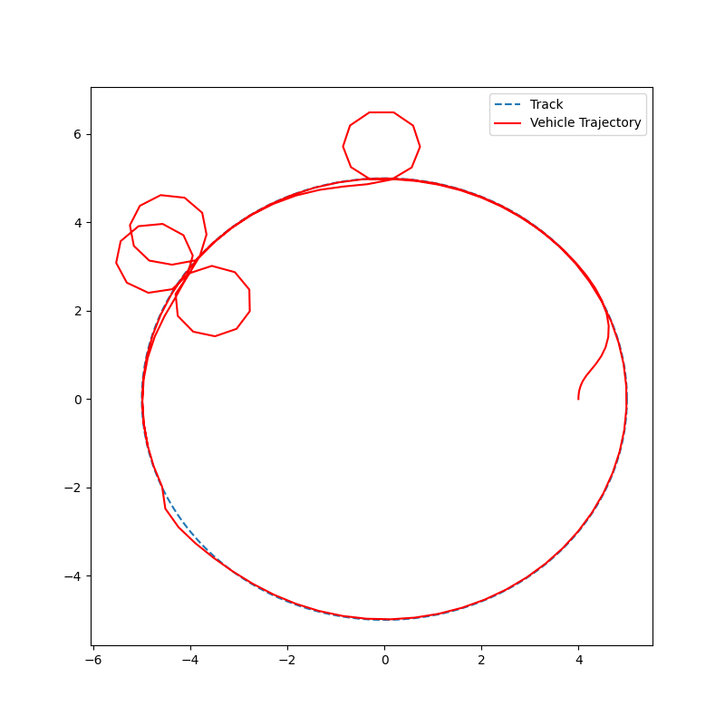
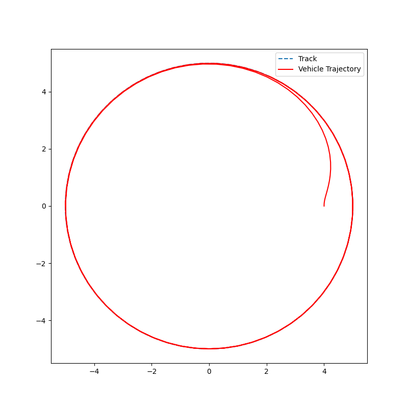

# Model Predictive Contouring Control (MPCC) for Autonomous Vehicle Track Following

This repository implements a **Model Predictive Contouring Controller (MPCC)** for a kinematic bicycle model navigating a circular race track while avoiding both static and dynamic obstacles.

The controller optimizes vehicle motion by minimizing contouring and lag errors while maximizing progress along the track. Obstacle avoidance is handled using configuration-space obstacle representations and soft collision constraints.

---

## Features

- Kinematic Bicycle Model
- Model Predictive Contouring Control (MPCC)
- Circular Track Following
- Static Obstacle Avoidance
- Dynamic Obstacle Avoidance
- Configuration Space (Minkowski Sum) Collision Modeling
- Soft Collision Constraints using Slack Variables
- Warm Starting for Improved Solver Performance
- CasADi + IPOPT Optimization Backend

---

## Repository Structure

```text
.
├── dynamics.py          # Kinematic bicycle model
├── mpcc.py              # MPCC controller implementation
├── track.py             # Circular track representation
├── utils.py             # Contouring and lag error computation
├── run_simulation.py    # Main simulation script
├── Image1.png           # Successful track-following result
└── Figure_2_orrientation_ignorance_cold_start_desync.png
                         # Cold-start/orientation desynchronization example
```

---

## Overview

The controller follows a circular reference trajectory while simultaneously:

- Minimizing deviation from the reference track.
- Maximizing forward progress along the track.
- Maintaining correct vehicle orientation.
- Avoiding static and dynamic obstacles.
- Producing smooth steering and acceleration profiles.

The implementation follows the MPCC formulation commonly used in autonomous racing and trajectory optimization.

---

## Vehicle Dynamics

The vehicle is modeled using a kinematic bicycle model:

\[
x_{k+1} = x_k + \Delta t \, v_k \cos(\psi_k)
\]

\[
y_{k+1} = y_k + \Delta t \, v_k \sin(\psi_k)
\]

\[
\psi_{k+1} = \psi_k + \Delta t \frac{v_k}{L}\tan(\delta_k)
\]

\[
v_{k+1} = v_k + \Delta t \, a_k
\]

where:

| Symbol | Description |
|----------|------------|
| \(x,y\) | Vehicle position |
| \(\psi\) | Vehicle heading |
| \(v\) | Vehicle velocity |
| \(a\) | Acceleration |
| \(\delta\) | Steering angle |
| \(L\) | Wheelbase |

---

## MPCC Formulation

### State Vector

\[
X = [x,\; y,\; \psi,\; v,\; \theta]
\]

### Control Vector

\[
U = [a,\; \delta,\; v_{\theta}]
\]

where:

- \( \theta \) represents progress along the track.
- \( v_{\theta} \) is the virtual progress velocity.

---

## Cost Function

The optimizer minimizes:

\[
J =
q_c e_c^2
+
q_l e_l^2
+
q_h e_h^2
-
q_p v_{\theta}
+
R_u
+
R_{\Delta u}
+
R_{slack}
\]

### Components

| Term | Purpose |
|--------|---------|
| Contouring Error \(e_c\) | Penalizes lateral deviation |
| Lag Error \(e_l\) | Keeps progress synchronized |
| Heading Error | Prevents reverse driving and looping |
| Progress Reward | Encourages forward motion |
| Control Cost | Penalizes aggressive inputs |
| Input Rate Cost | Produces smooth controls |
| Slack Cost | Softens collision constraints |

---

## Obstacle Avoidance

### Static Obstacles

Static obstacles are represented as configuration-space circles:

```text
[cx, cy, radius]
```

Collision avoidance is enforced using:

\[
d^2 + s \ge r^2
\]

where:

- \(d\) is the distance to the obstacle center.
- \(r\) is the combined obstacle radius.
- \(s\) is a slack variable.

---

### Dynamic Obstacles

Dynamic obstacles are predicted over the MPC horizon and represented as:

```text
DynObs[:, k]
```

The optimizer enforces collision avoidance at every future timestep.

---

## Configuration Space Modeling

Instead of directly modeling rectangle-to-rectangle collisions, the vehicle and obstacle footprints are converted into a configuration-space representation using a Minkowski Sum.

This produces a circular keep-out zone that simplifies the nonlinear optimization problem while maintaining safe obstacle avoidance.

---

## Running the Simulation

Install dependencies:

```bash
pip install numpy scipy matplotlib casadi
```

Run the simulation:

```bash
python run_simulation.py
```

The simulation will:

1. Create a circular reference track.
2. Initialize the vehicle state.
3. Predict dynamic obstacle motion.
4. Solve the MPCC optimization problem.
5. Propagate vehicle dynamics.
6. Visualize the resulting trajectory.

---

## Results

### Successful Track Following

The vehicle converges to the reference track and completes smooth laps while maintaining stable progress.

<p align="center">
  
</p>

---

### Cold-Start / Orientation Desynchronization

The figure below illustrates a failure mode caused by poor initialization and heading-track desynchronization. The optimizer may briefly generate loops before recovering.

<p align="center">
  
</p>

This issue was mitigated through:

- Heading alignment penalties
- Warm-starting the optimizer
- Progress velocity constraints
- Steering smoothness penalties

---

## Key Parameters

| Parameter | Value |
|------------|--------|
| Horizon | 25 |
| Time Step | 0.1 s |
| Wheelbase | 0.33 m |
| Track Radius | 5 m |
| Max Velocity | 5 m/s |
| Max Steering | 0.8 rad |

---

## Future Work

- Arbitrary spline-based race tracks
- Multi-obstacle scenarios
- Dynamic obstacle prediction models
- Frenet-frame MPCC
- Real-time implementation
- ROS2 integration
- Control Barrier Function (CBF) safety layer
- Dynamic bicycle model extension

---

## References

1. Liniger, A., Domahidi, A., & Morari, M.
   **Optimization-Based Autonomous Racing of 1:43 Scale RC Cars**

2. Liniger, A.
   **Model Predictive Contouring Control for Autonomous Racing**

3. CasADi Documentation

4. IPOPT Optimization Solver

---

## Author

**M. Akshith**  
Robotics Research Center  
International Institute of Information Technology Hyderabad (IIIT-H)
